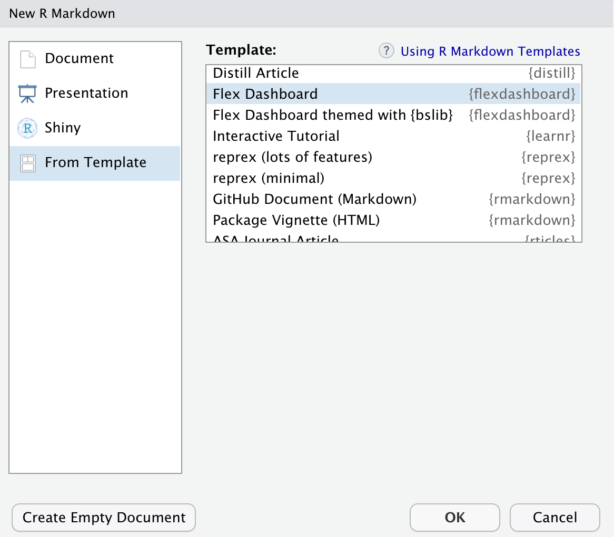

<!-- README.md is generated from README.Rmd. Please edit that file -->

# flexdashboard <a href='https://flexdashboard.rmarkdown.io'></a>

The goal of flexdashboard is to make it easy to create interactive
dashboards for R, using R Markdown.

  - Use [R Markdown](http://rmarkdown.rstudio.com) to publish a group of
    related data visualizations as a dashboard.

  - Support for a wide variety of components including
    [htmlwidgets](http://www.htmlwidgets.org); base, lattice, and grid
    graphics; tabular data; gauges and value boxes; and text
    annotations.

  - Flexible and easy to specify row and column-based
    [layouts](http://rmarkdown.rstudio.com/flexdashboard/layouts.html).
    Components are intelligently re-sized to fill the browser and
    adapted for display on mobile devices.

  - [Storyboard](http://rmarkdown.rstudio.com/flexdashboard/using.html#storyboards)
    layouts for presenting sequences of visualizations and related
    commentary.

  - Optionally use [Shiny](http://shiny.rstudio.com) to drive
    visualizations dynamically.

Learn more about flexdashboard: <https://flexdashboard.rmarkdown.io>

## Examples

<a href="https://beta.rstudioconnect.com/jjallaire/htmlwidgets-d3heatmap/"></img></a>  <a href="https://beta.rstudioconnect.com/jjallaire/htmlwidgets-ggplotly-geoms/"></img></a>  <a href="https://jjallaire.shinyapps.io/shiny-biclust/"></img></a>

## Installation

Install the **flexdashboard** package from CRAN as follows:

``` r
install.packages("flexdashboard")
```

To author a flexdashboard you create an [R
Markdown](http://rmarkdown.rstudio.com) document with the
`flexdashboard::flex_dashboard` output format. You can do this from
within RStudio using the **New R Markdown** dialog:



If you are not using RStudio, you can create a new `flexdashboard` R
Markdown file from the R console:

``` r
rmarkdown::draft("dashboard.Rmd", 
                 template = "flex_dashboard", 
                 package = "flexdashboard")
```

## Getting help

There are two main places to get help with flexdashboard:

  - The [RStudio
    community](https://community.rstudio.com/tag/flexdashboard) is a
    friendly place to ask any questions about flexdashboard.

  - [Stack
    Overflow](https://stackoverflow.com/questions/tagged/flexdashboard)
    is a great source of answers to common flexdashboard questions. It
    is also a great place to get help, once you have created a
    reproducible example that illustrates your problem.
